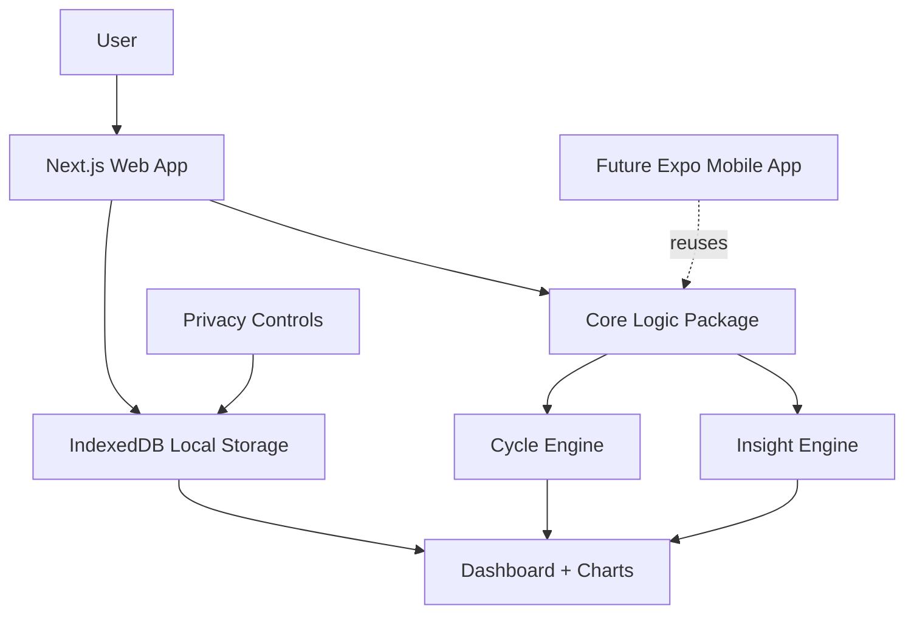

# Architecture Diagram

## Simple Architecture

## Notes

- The web app is the first build target.
- Sensitive user data starts local-first in IndexedDB.
- Core logic is separated so a future Expo mobile app can reuse it.
- Privacy controls manage export, delete, and future sync choices.
