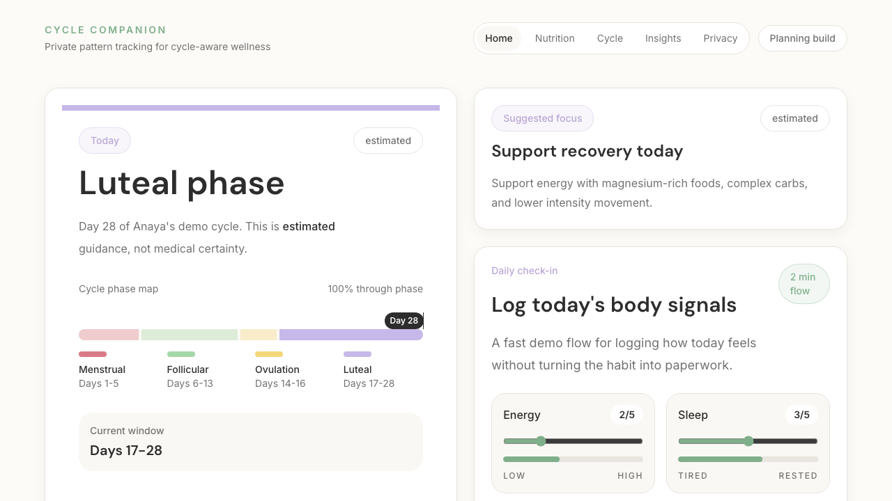
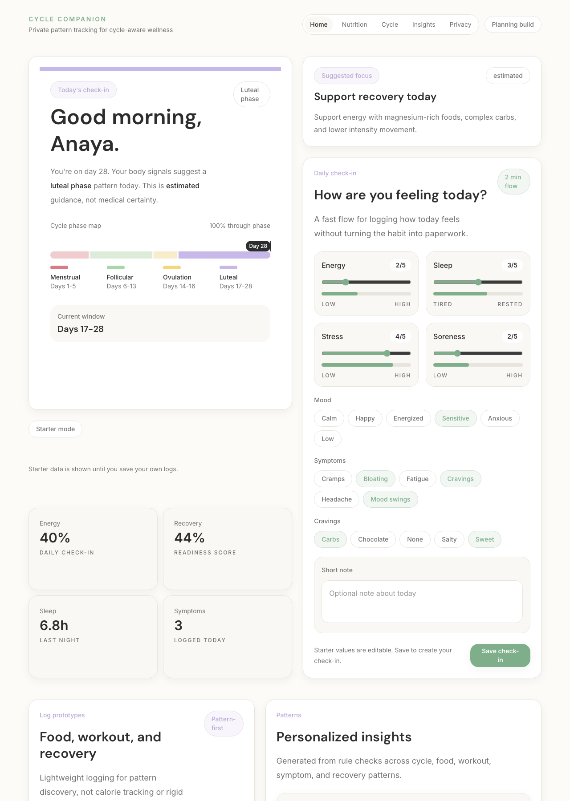
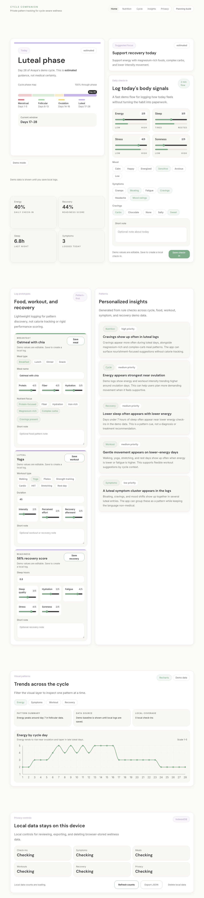

# Cycle-Aware Fitness + Food Companion

Privacy-first wellness dashboard for tracking patterns across cycle phase, food, workouts, energy, symptoms, and recovery.

This is a portfolio project focused on polished product design, local-first data handling, responsible health-adjacent UX, and clear technical architecture.

Live demo: coming soon.

## Screenshots

### Dashboard First Screen

Cycle phase, suggested focus, daily check-in, and primary dashboard metrics.



### Dashboard Extended View

Food, workout, recovery, insights, and pattern-focused dashboard sections.



### Pattern Viewer

Interactive filters for energy, symptoms, workout, and recovery trends.



## What Is Built

- Dashboard-first Next.js app
- Cycle phase visualization
- Daily check-in logging
- Food, workout, and recovery logging
- Rule-based insights
- Recharts pattern visualizations
- Interactive chart filters
- IndexedDB local-first storage
- Export/delete local data controls
- Dedicated privacy/settings page
- Clear loading, empty, and error states

## Stack

- Next.js
- TypeScript
- Tailwind CSS
- Recharts
- IndexedDB

Future mobile direction: Expo + React Native.

## Run Locally

```bash
cd apps/web
npm install
npm run dev
```

Open `http://localhost:3000`.

Useful checks:

```bash
npm run lint
npx tsc --noEmit
npm run build
```

## Project Notes

- Sensitive wellness data stays local-first.
- Demo data is separate from local user logs.
- The app avoids fertility prediction, diagnosis, treatment advice, and medical claims.

Deeper docs:

- [Case Study](./Cycle%20Tracker%20App%20Case%20Study/README.md)
- [Implementation Steps](./Cycle%20Tracker%20App%20Case%20Study/docs/011-implementation-steps.md)
- [Technical Architecture](./Cycle%20Tracker%20App%20Case%20Study/docs/009-technical-architecture.md)
- [Deployment Notes](./docs/deployment.md)
