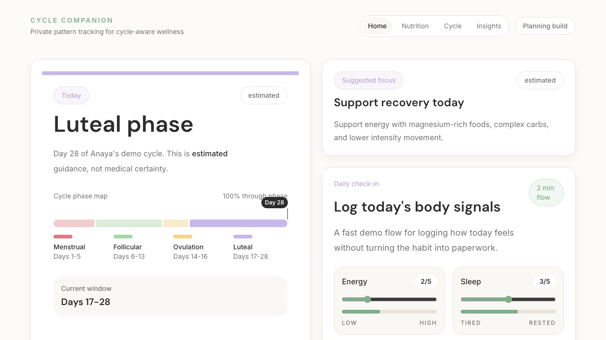
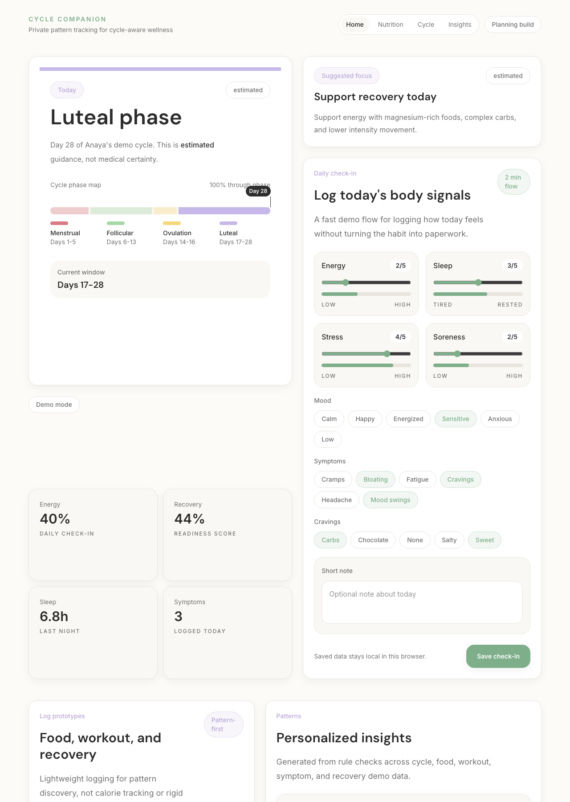

# Cycle-Aware Fitness + Food Companion

A privacy-first wellness dashboard that helps users understand relationships between cycle phases, food, workouts, energy, symptoms, and recovery.

The goal is not to create a generic period tracker. The goal is to show how sensitive health-adjacent data can be modeled, visualized, and turned into responsible pattern-based insights through a polished web app.

## Product Focus

The app is designed for women who want to understand body patterns across their cycle, including:

- Current cycle phase and cycle day
- Energy and mood trends
- Symptoms and cravings
- Food and nutrient focus
- Workout intensity and recovery
- Sleep, stress, soreness, and readiness patterns

The product intentionally avoids fertility prediction, diagnosis, treatment advice, medical claims, and health data sharing. Insight language is written as pattern guidance, using phrases like "appears," "shows up often," and "may be related."

## Current Build Status

Implemented so far:

- Next.js web app foundation
- TypeScript domain models for cycle, food, workout, recovery, symptoms, insights, and privacy
- Demo data for 3 complete 28-day cycles
- Cycle phase estimation utilities
- Dashboard-first app experience
- Current cycle phase visualization
- Daily check-in prototype
- Food, workout, and recovery logging prototypes
- Recharts visualizations for energy, workout intensity, and symptom patterns
- Rule-based insight engine
- Local-first IndexedDB storage layer
- Daily check-in saving to local browser storage
- Local data counts, JSON export, and delete controls
- Dashboard sync between saved local data and demo fallback data
- Case study documentation and implementation notes

## Screenshots

### Dashboard First Screen



### Dashboard Extended View



## Tech Stack

- Framework: Next.js
- Language: TypeScript
- Styling: Tailwind CSS
- Charts: Recharts
- Storage: IndexedDB local-first layer
- Deployment target: Vercel free tier
- Future mobile path: Expo + React Native

The project is intentionally web-first, but the domain models and core logic are separated so they can later be reused in a mobile app.

## Architecture

The code is organized by responsibility:

- `apps/web/src/domain` contains TypeScript data models.
- `apps/web/src/data` contains demo data only.
- `apps/web/src/core` contains reusable logic such as cycle calculations and rule-based insights.
- `apps/web/src/storage` contains the local-first IndexedDB wrapper.
- `apps/web/src/features/dashboard` contains dashboard UI modules.
- `Cycle Tracker App Case Study/docs` contains product, design, architecture, privacy, and implementation decision notes.

## Privacy Approach

Cycle, symptom, food, workout, and recovery data are treated as sensitive personal data.

Current privacy decisions:

- Store user logs locally first with IndexedDB.
- Keep demo data separate from real local user data.
- Show whether the dashboard is using local data or demo data.
- Let users export and delete browser-stored data.
- Avoid third-party analytics for the MVP.
- Avoid medical or diagnostic claims.
- Avoid cloud sync until the product has stronger privacy and account decisions.

## Run Locally

```bash
cd apps/web
npm install
npm run dev
```

Open:

```text
http://localhost:3000
```

Useful checks:

```bash
npm run lint
npx tsc --noEmit
npm run build
```

## Case Study

The deeper product and engineering documentation lives here:

- [Cycle App Case Study](./Cycle%20Tracker%20App%20Case%20Study/README.md)
- [Build Stages](./Cycle%20Tracker%20App%20Case%20Study/docs/001-build-stages.md)
- [Design Direction](./Cycle%20Tracker%20App%20Case%20Study/docs/003-design-direction.md)
- [Privacy Strategy](./Cycle%20Tracker%20App%20Case%20Study/docs/004-privacy-first-data.md)
- [Technical Architecture](./Cycle%20Tracker%20App%20Case%20Study/docs/009-technical-architecture.md)
- [Implementation Steps](./Cycle%20Tracker%20App%20Case%20Study/docs/011-implementation-steps.md)

## Next Planned Steps

- Add a privacy/settings screen.
- Add local persistence for food, workout, and recovery logs.
- Expand chart interactions and empty states.
- Add stronger loading, empty, and error states around local storage.
- Prepare screenshots and deployment notes for portfolio review.
